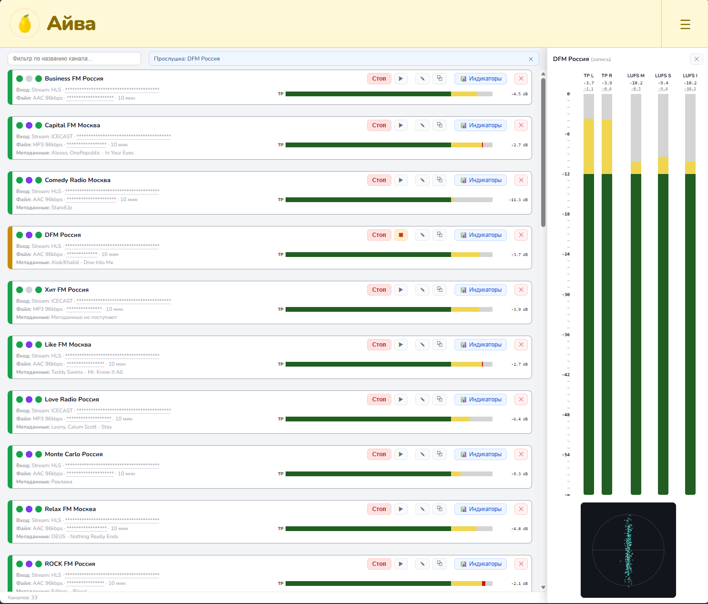
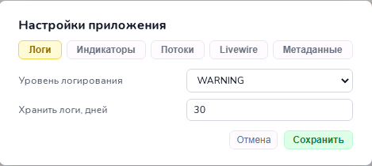
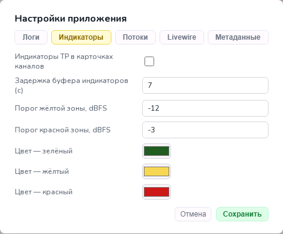
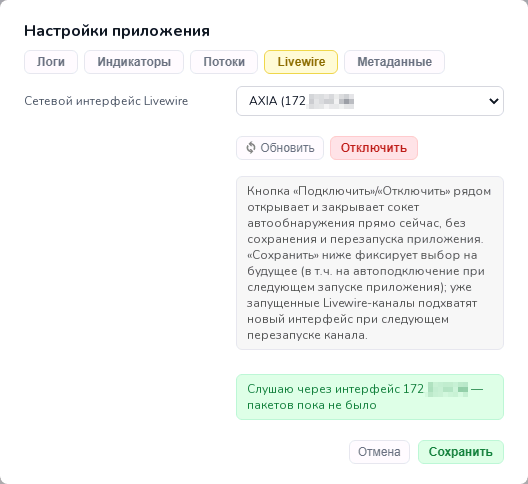
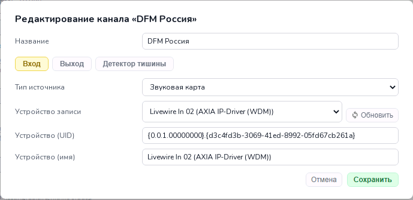
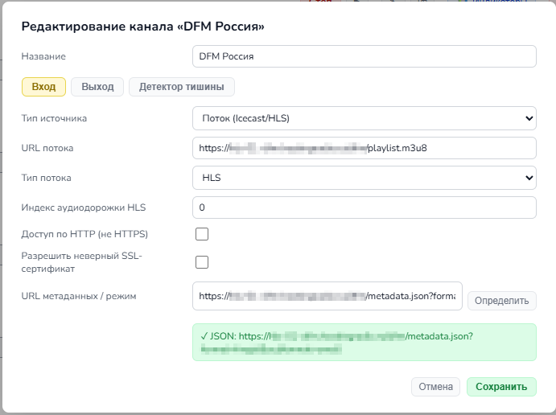
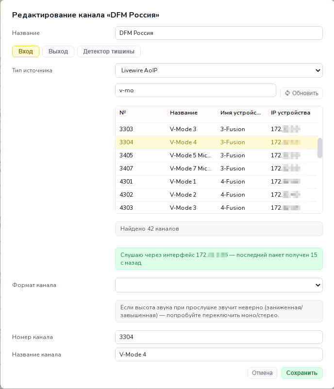
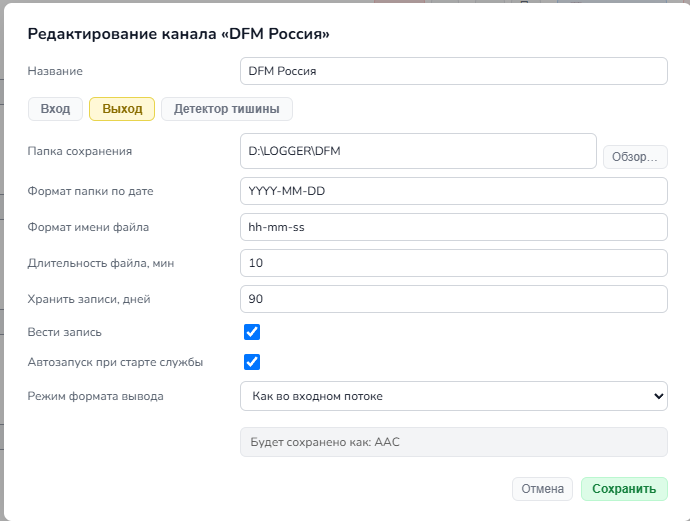
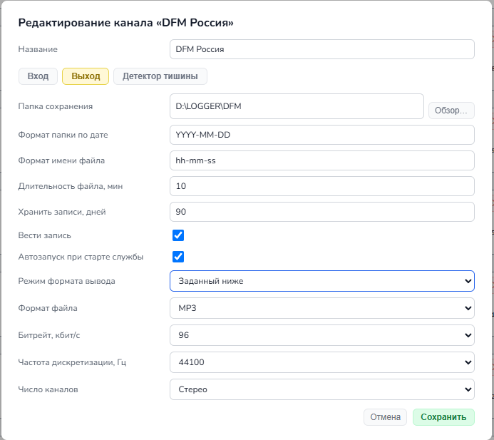
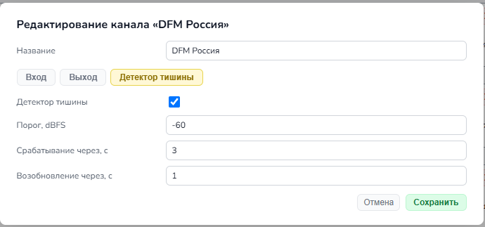

# Айва (Quince): Быстрый старт

Многоканальный аудиологгер — веб-приложение на ASP.NET Core (Blazor Server). Рекомендуется использовать как службу Windows. 



> Лицензия: GNU GPL v3 (`LICENSE.md`) — бесплатное opensource-приложение.
> © 2026 Роман Ермаков


---
## Системные ребования

- Windows x64.
- Для разработки/сборки: .NET 8 SDK.
- Для запуска у пользователя: **ничего дополнительно ставить не нужно** — при сборке приложение включает весь нужный .NET-рантайм рядом с `Quince.Service.exe`.
- Аудио-движок использует  `ffmpeg.exe`/`ffprobe.exe` для сетевых потоков (в комплекте в папке `Quince.Service\tools\`) и NAudio (управляемая библиотека, MIT) для захвата со звуковой карты — для запуска тоже ничего отдельно скачивать не нужно.

---
## Ручная сборка

1. Установите [dotNET 8 SDK](https://dotnet.microsoft.com/en-us/download/dotnet/8.0).

2. Перейдите в папку репозитория. Выполните:

   ```
   dotnet run --project .\Quince.Service\
   ```

   или из папки `Quince.Service\`:

   ```
   dotnet run
   ```

3. Убедитесь что приложение работает. Проверьте подключение к веб-интерфейсу.

4. Выполните команды для сборки .exe:

   ```
   dotnet build .\Quince.Service\
   dotnet publish .\Quince.Service\ -c Release -o .\release\<версия>
   ```

Приложение слушает `http://localhost:5000` (см. `appsettings.json`, ключ `Urls`).


---
## Использование в качестве службы Windows

Приложение уже подготовлено для запуска как служба Windows.

### Установка и запуск

Для создания службы:

1. Опубликуйте релиз (см. "Ручная сборка" выше) в постоянную папку, например `C:\Quince\`.
2. Откройте командную строку **от имени администратора** и выполните:
   ```
   sc.exe create QuinceAudioLogger binPath= "C:\Quince\Quince.Service.exe" start= auto DisplayName= "Quince Audiologger"
   sc.exe description QuinceAudioLogger "Multichannel audio logger service."
   ```
3. Запустите службу:
   ```
   sc.exe start QuinceAudioLogger
   ```
4. Веб-интерфейс станет доступен по тому же адресу, что и при обычном запуске (`http://localhost:5000` — см. `appsettings.json`, ключ `Urls`).

### Перезапуск службы:
```
sc.exe stop QuinceAudioLogger
sc.exe start QuinceAudioLogger
```
или через Computer Management как локально, так и удалённо.

### Удаление службы:
```
sc.exe stop QuinceAudioLogger
sc.exe delete QuinceAudioLogger
```
Готовые bat-скрипты для тех же действий в `Quince.Service\tools\`:
- `service-create.bat`
- `service-start.bat`
- `service-stop.bat`
- `service-restart.bat`
- `service-delete.bat`.
Каждый скрипт проверяет права администратора и при необходимости перезапускает себя с UAC-запросом (`powershell Start-Process -Verb RunAs`) — отдельно запускать «от имени администратора» не нужно, достаточно обычного двойного клика.

### Обновление приложение под службой:
1. Остановить службу (`sc.exe stop QuinceAudioLogger`)
2. Заменить файлы в `C:\Quince` новой публикацией
3. Запустить службу снова (`sc.exe start QuinceAudioLogger`)

Папки `config/`/`log/` при этом трогать не нужно, там ваша конфигурация и логи. Проверьте вручную, сравнив с config.demo - не появились ли в новой версии новые параметры.

---
## Расположение данных

>[!waRNING]
> Перед работой с файлами конфигурации вручную ознакомьтесь с [синтаксисом YAML](https://blog.skillfactory.ru/glossary/yaml/).

Все рабочие данные приложения лежат **рядом со скомпилированным `Quince.Service.exe`** (не зависят от того, как и откуда запущен процесс, но важно для установки как службы Windows, где рабочая директория обычно не совпадает с папкой приложения):

- `config\`
  - `settings.yaml` (настройки приложения)
  - опционально `ldap.yaml`/`users.yaml`/`secret.yaml`/`sessions.yaml` (авторизация, см. «Авторизация» ниже);
  - YAML-конфиги каналов лежат в подпапке `config/stations\`.
  Путь к папке каналов настраивается ключом `ConfigDir` в `appsettings.json` (по умолчанию `"config"`).
- `log\` — файлы журнала, по одному на день.
  Путь к папке журналов настраивается ключом `LogDir` в `appsettings.json` (по умолчанию `"log"`).

  >[!TIP]
  > Пути (`config`, `log`) можно также задать абсолютными. Тогда они не привязываются к папке приложения.

- `config.demo\` - образцы конфигураций. Перед первым запуском скопируйте в `config\` и отредактируйте под себя:
  - удалите/замените пример станции в `stations\`, при необходимости настройте `ldap.yaml`/`users.yaml`/`secret.yaml` (см. «Авторизация» ниже).
  
  >[!INFO]
  > Без этого шага приложение всё равно запустится — `config\` создастся пустым автоматически, среди станций будет пусто и авторизация будет выключена (нет `ldap.yaml` — нет и файла-переключателя).

---
## Настройки приложения

### Журнал (`log\`)


Логи можно анализировать сторонними системами мониторинга (Zabbix и проч.):
- Новый файл каждый день: `log/YYYY-MM-DD.log`.
- Уровень логирования настраивается через `log_level` в `app.yaml` (DEBUG/INFO/WARNING/ERROR).
- Старые файлы удаляются автоматически по истечении `log_retention_days` дней (по умолчанию 30).

### Индикаторы

Для плавного отображения индикаторово в браузере аудиопоток буферизируется на 7 секунд. Увеличьте значение если индикаторы "примерзают". Воспроизведение прослушки идет с учетом этого буфера.

  >[!INFO]
  > Выбор устройства аудиовывода для прослушки в браузере не реализован, поскольку это требует `setSinkId()` и HTTPS. Прослушка идёт на аудиоустройство по умолчанию.


### Потоки

Пауза между попытками переподключения при обрыве потока/устройства — общая для всех каналов настройка.

### Livewire

Возможность получать из AoIP-сети Livewire мультикаст на выбранный сетевой интерфейс.

  > [!TIP]
  > Если подключение к Livewire не нужно, выберите сетевой интерфейс = Нет. В этом случае, а также если выбранный сетевой интерфейс отключён, источника "Livewire" в карточке канала не будет.

### Метаданные

Список слов-маркеров через запятую по которым в .csv с метаданными к строке будет применяться класс элемента "Реклама" и "Новости". Для остальных элементов класс = "Музыка".

---
## Настройки канала записи

|  | ||
|---|---|---|

Источником для записи может быть вход аудиоустройства (в т.ч. IP-драйвера), интернет-поток (Icecast mp3/aac или HLS) и канал Livewire.

Если папка сохранения не указана в настройках канала, автоматически создаётся папка `recording` внутри папки Айвы. Ошибка показывается только если диск или сетевой путь реально недоступны. 

|  |  |
|---|---|

Опция «Как во входном потоке» сохраняет звук в формате, соответствующем источнику:
- для звуковой карты это WAV PCM с той же частотой дискретизации и числом каналов, с которыми шёл захват;
- для HLS-потока это AAC с оригинальным битрейтом (можно указать индекс битрейта 0 / 1 / 2 из мультибитрейтного `playlist.m3u8`);
- для Icecast это MP3 с оригинальным битрейтом.

|  |
|---|

При обнаружении тишины (3 секунды звук был тише порога в -60 dBFS) запись останавливается и возобновляется через 1 секунду после устойчивого появления звука выше порога.


---
## Авторизация (`config\ldap.yaml`)

Авторизация **по умолчанию отключена** — приложение открывается без запроса входа. Чтобы включить авторизацию, создайте `config\ldap.yaml`; чтобы выключить обратно — удалите файл. Готовый пример лежит в `config.demo\ldap.yaml`/`users.yaml`/`secret.yaml` — скопируйте и отредактируйте под свои нужды.

**`config\ldap.yaml`** (пример: вход только из списка локальных пользователей в `config\users.yaml`):
```yaml
Local: true    # включить проверку по config/users.yaml
```

**`config\ldap.yaml`** (пример: локальный вход + один домен AD):
```yaml
Local: true    # включить проверку по config/users.yaml
LDAP: true     # включить проверку по Active Directory

# Группы AD с правами администратора — участники get IsAdmin (ничего в UI не ограничивает,
# кроме самого факта входа; задел на будущее разделение прав)
admin_groups:
  - "CN=RadioAdmins,OU=Groups,DC=corp,DC=local"

# Если задать непустым — входить смогут только участники этих групп (остальные аутентифицированные
# доменные пользователи получат отказ). Пусто/не задано: входит любой, кто прошёл
# аутентификацию в одном из доменов ниже.
# access_groups:
#   - "CN=RadioUsers,OU=Groups,DC=corp,DC=local"

server: "ldap://dc01.corp.local"
domain: "CORP"
base_dn: "DC=corp,DC=local"
bind_secret: 10   # опционально — id сервисного аккаунта из config\secret.yaml для поиска пользователя по имени

# Несколько доменов — вместо server/domain/base_dn/bind_secret выше:
# domains:
#   - name: "CORP"
#     server: "ldap://dc01.corp.local"
#     base_dn: "DC=corp,DC=local"
#     bind_secret: 10
```

`Local`/`LDAP` — единственные два ключа, которые пишутся с заглавных букв; всё остальное — строчными, как и везде в конфигах Айвы. Формат имени пользователя на странице входа:
- `ivanov` (перебор всех настроенных доменов),
- `CORP\ivanov` (только домен с `name: CORP`),
- `ivanov@corp.local` (только домен с таким UPN-суффиксом, выводится из `base_dn` или задаётся явно полем `upn_suffix`).

**`config\users.yaml`** (локальные учётные записи, нужен только при `Local: true`):
```yaml
users:
  - username: admin
    password_hash: "$2a$11$..."   # BCrypt-хэш, см. ниже
    is_admin: true
```
Хэш пароля генерируется без вспомогательных скриптов — прямо самим exe:
```
Quince.Service.exe --hash-password
```

>[!IMPORTANT]
> Если `Local: true`, а `config\users.yaml` отсутствует, при каждом запуске генерируется случайный одноразовый пароль для пользователя `admin` и выводится в лог (`[WARNING] ... логин: admin  пароль: ...`) как временная мера, не для постоянного использования!

**`config\secret.yaml`** (опционально — сервисный аккаунт для поиска пользователя перед проверкой его пароля; без него используется прямой bind под учётными данными самого входящего):
```yaml
authorization:
  - id: 10
    username: "ldap"
    password: "ldap-service-password"
    domain: "CORP"
```

Сеансы входа хранятся в памяти и дублируются в `config\sessions.yaml`, поэтому переживают перезапуск приложения/службы — не нужно логиниться заново после каждого обновления версии. Время жизни сеанса по умолчанию: 1 неделя (параметр `auth_session_ttl_seconds` в `settings.yaml`).


---
## Сторонние бинарные компоненты

Всё нужное для работы бандлируется прямо в `release/<версия>/` — отдельно ничего скачивать и ставить не нужно. Два сторонних бинарника (для сетевых потоков — захват со звуковой карты идёт через управляемую библиотеку NAudio, без отдельных нативных файлов):

| Файл | Расположение | Источник | Лицензия |
|---|---|---|---|
| `ffmpeg.exe` | `Quince.Service/tools/` | официальная статическая сборка [gyan.dev](https://www.gyan.dev/ffmpeg/builds/) (`essentials_build`) | GPL/LGPL (FFmpeg) — свободное использование, в т.ч. коммерческое |
| `ffprobe.exe` | `Quince.Service/tools/` | сборка того же семейства gyan.dev `essentials_build` | GPL/LGPL (FFmpeg) — свободное использование, в т.ч. коммерческое |
| `ucrtbase.dll` + 14×`api-ms-win-crt-*.dll` (Universal C Runtime) | `Quince.Service/redist/ucrt/` | скопированы с машины разработки (`C:\Windows\System32` / `System32\downlevel`) | Microsoft — официально документированный способ «app-local deployment» UCRT; нужны на Windows без встроенной UCRT (Windows 7 SP1/8/8.1 без KB2999226/VC++ Redistributable) — без них self-contained-сборка падает с ошибкой «api-ms-win-crt-runtime-l1-1-0.dll is missing» при запуске |

Захват со звуковой карты (`SoundcardCapture`) реализован через [NAudio](https://github.com/naudio/NAudio) (MIT — свободное использование, включая коммерческое, без каких-либо оговорок) поверх WASAPI. Отдельного нативного файла для этого не требуется, NAudio подключается как обычный NuGet-пакет и попадает в сборку вместе с остальными управляемыми зависимостями.

При необходимости обновить/заменить `ffmpeg.exe`/`ffprobe.exe` — просто перезапишите файлы тем же именем в той же папке, рестарт приложения подхватит новую версию.

**`tools\Find-Replace.ps1`** — рекурсивный поиск-замена литерального текста (не regex) во всех файлах папки. Поддерживает стандартные `-WhatIf`/`-Confirm` для предпросмотра без реальной записи.
```powershell
.\tools\Find-Replace.ps1 -Find 'localhost:5000' -Replace 'localhost:8080' -Path C:\Quince\config

# Предпросмотр без изменения файлов
.\tools\Find-Replace.ps1 -Find 'старое' -Replace 'новое' -Path .\config -WhatIf
```

---
## Donate

## Donate
 🇷🇺 RU: [https://yoomoney.ru/to/4100135835863](https://yoomoney.ru/to/4100135835863)

 🇰🇿 KZ: `5269 8800 2632 9839`

🌎 International: `0x0EDe142a3D9f1D556562e112A9bC34c220158C9A` *(ETH, BNB, Poly, Arbitrum, Base)*
